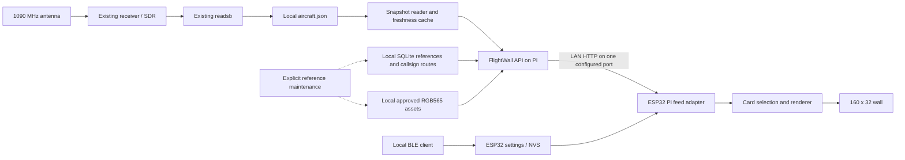

# FlightWall architecture and implementation plan

Status: target design with implemented Pi routes and an initial local feed/parser;
canonical migration is incomplete.
Baseline reviewed on 2026-10-03 against commit
`500a49c67a73bb4d9ea3da131115bdaf4db84dec`; route implementation notes updated
on the same date. M1 documentation and integration of main's initial local feed
(`8418bdc974a15c813f567ef136ac1126e12e35e8`) updated on 2026-10-04.

This document turns the [original implementation plan](docs/flightwall-local-plan.md)
into the architecture to follow. Use the [milestone checklist](docs/implementation-plan.md)
for execution, the [decision log](docs/decisions.md) for rationale, and the
[project context](docs/project-context.md) for current evidence and handoff notes.

## 1. Outcome and release scope

A 160×32 WS2812B wall displays aircraft heard by the existing local ADS-B receiver.
The Raspberry Pi supplies received telemetry, local reference lookups, and approved
logo assets. The ESP32 contacts only the configured Pi during flight operation.
Wi-Fi credentials, Pi host/port, and mutable display settings can be changed over
BLE and survive reboot without reflashing.

The source plan records an existing readsb installation and a Pi 5 with 1 GB RAM
as the initial target. Those installation details still need direct verification.
Reuse the receiver; do not start a second decoder or SDR owner. Move to the Pi 4
with 4 GB only if measurements justify it.

The first release includes the local flight path, persistent BLE provisioning,
operator/type enrichment, approved local logos with text fallbacks, altitude,
GS, signed vertical speed, IAS/TAS when received, and explicit failure states.
Worldwide coverage, local airport observations, and mDNS are later work. For
overhead flights, the recommended route source is a local import of CC0 VRS
callsign-route records. A match supplies a reference airport pair without observing
a landing; it does not confirm the current flight's dated itinerary. See
[route lookup research](docs/route-detection.md) for verified source examples,
Google/manual verification, and the coverage evaluation to perform in M4.
The first integration gate is one real received aircraft on the physical wall
with the cloud flight adapters disabled; that gate alone is not the full release.

## 2. Current implementation and review findings

| Area | Verified current behavior | Migration requirement |
| --- | --- | --- |
| [Pi server](pi_enrichment/server.py) | Serves a one-second-cached prototype `/v1/flights` from file/HTTP, registry health/meta/lookup, legacy live enrichment, and `/v1/routes/{callsign}`. Route reads are local, pinned, and bounded. | Migrate the prototype to the canonical M1 envelope, progress/clock rules, geographic selection and byte bounds; join routes into the feed. |
| [Route maintenance](pi_enrichment/route_pipeline.py) and [resolver](pi_enrichment/route_reference.py) | Stream pinned CC0 VRS tables into validated immutable SQLite generations; indexed offline lookups, aliases, ordered airport codes, dated overrides, and rollback exist. | Measure actual traffic correctness/coverage and Pi resources; adopt route fields in the canonical feed and firmware. |
| [FAA importer](pi_enrichment/faa_pipeline.py) | Selects MASTER from the FAA archive; imports into the active DB inside a transaction. Does not join ACFTREF. Owner can populate `operator_name`; FAA classification can populate `aircraft_type`. | Separate owner/operator/type semantics, join reference records, and stage complete dataset generations. |
| [Docker entrypoint](pi_enrichment/docker-entrypoint.sh) | Runs registry sync before starting the API when `RUN_FAA_SYNC_ON_START=true`; this is the base Compose default. | Production startup must serve cached data immediately and run updates separately. |
| [Simulator](flightwall_sim/simulator.py) | Its `/v1/flights` on port 8090 assembles synthetic aircraft from individual lookup requests. A failed poll retains the previous payload. | Consume the production contract and expire stale data instead of presenting old cards indefinitely. |
| [Firmware entrypoint](firmware/src/main.cpp) and [Pi adapter](firmware/adapters/PiFlightFeed.cpp) | Poll the prototype Pi feed, retain aircraft without callsigns/references, and exclude cloud adapters from the build. | Adopt M1 parsing, source ages/progress, monotonic expiry, selection by hex and retry/backoff; prove the physical local path. |
| [Flight model](firmware/models/FlightInfo.h) and [renderer](firmware/adapters/NeoMatrixDisplay.cpp) | Local cards include altitude, GS and vertical rate with unknown fallbacks; connection/stale/empty messages exist. Legacy mock cards use a text logo badge. | Add canonical provenance, expiry, IAS/TAS and ground-state semantics, approved bitmap assets and final pages. |
| [PlatformIO configuration](firmware/platformio.ini) | `espressif32` is unpinned and library dependencies use version ranges. | Select and record tested toolchain versions before choosing BLE provisioning APIs. |
| [Hardware configuration](firmware/config/HardwareConfiguration.h) and [Wokwi diagram](firmware/diagram.json) | Physical target is 160×32; mock is 64×32. Renderer uses tiled mapping in both. | Verify supported Wokwi parts and separate its pixel mapping from physical wiring. |
| [systemd templates](pi_enrichment/systemd/flightwall-enrichment.service) | Assume user `pi`, fixed paths, and a loopback tar1090 URL. | Discover actual Pi paths/user/permissions before adapting deployment files. |

The original plan has the right separation between local flight operation and
reference maintenance. This review adds explicit ownership of selection,
freshness without WAN time services, generation-safe updates, resource limits,
and a contract-first integration gate. Existing Docker checks prove enrichment
behavior, not receiver freshness, BLE, physical display mapping, or offline operation.

## 3. Component boundaries

Keep one lightweight Python API under `pi_enrichment/`, using the existing standard
library HTTP/SQLite foundation initially. Split receiver reading, normalization,
filtering, reference resolution, and asset serving into testable modules there as
needed. Do not introduce another production server, broker, or frontend to move
flight JSON. HTTP polling is sufficient for the first version.

The Pi owns source validation, geographic filtering, enrichment, and bounded
candidate ordering. The ESP32 owns selection by aircraft hex, dwell, display
pages, and the final local expiry check. A reordered response must not restart
dwell or select a different aircraft unnecessarily.

`flightwall_sim/` remains a development consumer/display preview. It must not
maintain a competing flight schema. [M1 draft contracts](docs/api/README.md) and
[shared examples](tests/fixtures/m1/README.md) now define the proposed boundary;
runtime adoption remains M2/M3 work. Wokwi is a development aid, not a deployed
runtime requirement. The [receiver inventory](docs/adsb-receiver-data.md) separates
decoded aircraft messages, decoder bookkeeping and reference annotations.

## 4. Proposed local API boundary

The full flight boundary has a versioned M1 draft schema, detailed contracts and
synthetic examples under [docs/api](docs/api/README.md). It is not yet frozen or
implemented in runtime. The [initial local API](docs/local-flight-api.md) already
occupies `/v1/flights`, with flat fields, Unix-second timestamps and `ok` status.
It shares `schema_version=1` with the incompatible M1 draft; that number alone
does not establish conformance. Resolve the wire migration/version before M1
freeze. Existing endpoints and the implemented route subset are identified
below. Initial production port is **8080**, configurable separately
on the Pi and in ESP32 settings. Port **8090** remains a development preview port.

| Endpoint | Responsibility |
| --- | --- |
| `GET /v1/flights` | Versioned envelope containing receiver state and bounded normalized candidates. |
| `GET /health` | Independent API process, receiver, and reference-data health. Retain existing health fields during migration; legacy `stale` refers to registry age. |
| `GET /v1/meta` | Active reference generation, provenance, checksums, counts, and update status. Preserve existing metadata fields during migration. |
| `GET /v1/aircraft/{hex}` | Compatible existing lookup response; document/deprecate ambiguous legacy owner/operator fields rather than silently changing their meaning. |
| `GET /v1/aircraft/live` | Preserve the legacy adapter during migration; new consumers use `/v1/flights`. |
| `GET /v1/routes/{callsign}` | Implemented full diagnostic lookup, also used in legacy live enrichment; the new flight feed uses an explicit [compact projection](docs/api/flights.md#64-compact-route-references-and-dated-evidence). |
| `GET /assets/logos/{content-hash}.rgb565` | Immutable, approved display asset on the same host and port as flight JSON. |

A successfully handled `/v1/flights` request returns HTTP 200 with a valid envelope
even if the receiver is empty or unavailable. Receiver state is domain data;
malformed requests and server faults still use appropriate 4xx/5xx responses.
Consumers reject unsupported schema versions and invalid envelopes safely.

| Contract group | Required semantics |
| --- | --- |
| Envelope | `schema_version`, process `instance_id`, source/state `sequence`, nullable `generated_at`, `receiver`, `selection`, `reference_sources`, `flights` and diagnostics. |
| Receiver | Status: `initializing`, `ready`, `stale`, `unavailable`, or `invalid`; original `snapshot_at`, `snapshot_age_ms`, progress age, clock confidence, and a stable reason code. |
| Identity | Strict six-character ICAO hex, original received callsign, normalized callsign, and display identifier. Callsign/operator/type may be unknown without excluding an otherwise eligible aircraft. |
| Timing | `last_seen_at`, `position_seen_at`, `last_seen_age_ms`, and `position_seen_age_ms`. Absolute timestamps are nullable when clock confidence is insufficient. |
| Position | Complete valid latitude/longitude and distance in km for emitted candidates; nullable bearing at a coincident center. Unknown/stale raw positions are not emitted as geographic candidates. |
| Telemetry | Nullable `altitude_baro_ft`, `altitude_geom_ft`, `ground_speed_kt`, `airspeed_ias_kt`, `airspeed_tas_kt`, `vertical_speed_fpm`, `vertical_speed_source`, and explicit ground state. |
| References | Registration, registered owner, operator identity, manufacturer/model, ICAO type designator, and FAA classification as separate fields with resolution provenance. |
| Logo | Nullable descriptor with resolved operator ID, relative hash path, SHA-256, dimensions, byte order and exact byte length. No arbitrary external URLs. |
| Route/events | Nullable callsign-route reference with airport sequence, source, matched callsign, dataset revision/age, and flight-instance verification status. Keep it separate from dated route overrides and `observed_departure_airport` / `observed_arrival_airport` events. Unknown is the default when unmatched or ambiguous. |

Map readsb `alt_baro: "ground"` to ground state and null numeric barometric altitude.
Without explicit surface/airborne evidence, ground state stays unknown.
Preserve valid zero values and the sign of climb/descent. GS must never be relabeled
IAS/TAS. Prefer barometric vertical rate when present and identify the selected
source. A registered owner is not evidence of the operating airline, and an ADS-B
emitter category or FAA numeric classification is not an ICAO model designator.

Use explicit nulls for unavailable optional fields in the canonical contract.
Do not sanitize arbitrary malformed hex strings into plausible identities; reject
invalid/non-ICAO pseudo-addresses with a diagnostic count. Bound string lengths and
numerical ranges in the schema and both parsers. M1 fixtures must cover complete,
partial, no-callsign, ground, unknown-reference, healthy-empty, stale, unavailable,
invalid-source, and oversized input cases.

## 5. Freshness, filtering, and state transitions

Read one configured local readsb snapshot about every second and cache an immutable
normalized result. A loopback HTTP adapter is allowed when the real installation
requires it. Never reread the decoder or query the internet for each client/aircraft.
Use the source `now`, `seen`, and `seen_pos`; serving a response must not make an
old snapshot fresh.

Freshness must work after an offline reboot without requiring ESP32 NTP. On the
Pi, combine trustworthy same-host source time with monotonic time since snapshot
progress. Establish progress at startup; file read success or mtime alone does
not prove a frozen snapshot is current. Handle backward/future clock jumps by
re-establishing freshness, and mark uncertain clock information explicitly.
Healthy empty snapshots still advance source time. The ESP32 adds monotonic elapsed
time since the request began to the supplied ages, so a slow response or failed
poll cannot extend a card's life. Counter wraparound and reboots need tests.

| Setting | Initial design budget | Validation |
| --- | --- | --- |
| Snapshot sampling | About 1 s | Verify normal readsb export cadence. |
| Snapshot expiry | 5 s | Frozen JSON becomes stale even while HTTP remains available. |
| Aircraft and position age limit | 15 s each | Preserve separate message and position ages; exclude expired positions. |
| Candidate cap | 8, sorted by emitted distance with a hex tie breaker | Return the complete nearest prefix; byte limiting may return fewer than eight. |
| ESP32 poll interval | 1–2 s | Measure end-to-end latency and avoid tight failure loops. |
| Card dwell | About 5 s | Preserve selected hex while eligible; remove it immediately on expiry. |
| Flight response bound | 16 KiB | Schema-valid eight-row Unicode example exceeds it; apply a serialization byte check, then measure parser heap before freezing. |
| HTTP timeout | Initially 2 s | Keep rendering and expiry responsive during stalled requests. |
| Retry backoff | Increase to a maximum around 15 s | Restore normal polling on recovery; expiry continues during backoff. |

These are provisional budgets, not verified operating measurements. Keep networking
outside the render loop's blocking path, using a bounded worker/state handoff or a
supported nonblocking approach. Cap snapshot bytes, request concurrency, asset
cache, and response allocations. The M1 draft proposes 4 MiB/512 source rows;
real receiver samples must confirm or revise those input limits.

Filter center/radius, optional view bearing, and altitude on the Pi. Use verified
receiver coordinates or explicit configuration; never adopt the firmware's sample
location as the installation location. Filters must define behavior for missing
altitude and positions. Missing enrichment is not a geographic filtering reason.

| Condition | Display behavior |
| --- | --- |
| No usable settings / setup requested | Setup instructions; BLE remains usable. |
| Wi-Fi disconnected | Wi-Fi state and bounded reconnect attempts. |
| Wi-Fi connected, Pi unreachable | Pi-unavailable state; retain network settings. |
| Receiver initializing/unavailable/invalid | Explicit receiver state; no normal live card. |
| Receiver stale / card expired | Remove the normal live card and show stale state. |
| Receiver ready, no eligible candidates | No nearby aircraft; distinguish healthy empty/filtering in diagnostics. |
| Reference data missing or old | Continue useful telemetry; show unknown fields and reference health separately. |
| Receiver ready, eligible partial aircraft | Render callsign or hex, available metrics, and neutral fallbacks. |

## 6. Reference maintenance and storage

Start with FAA MASTER joined to ACFTREF for US aircraft, and a versioned local
airline table. Resolve recognized operator prefixes from callsigns with dated
overrides and provenance. Preserve registration-like, unknown, and ambiguous
identifiers; do not guess an airline from any three-character prefix.

For overhead-flight routes, import the CC0
[VRS standing-data callsign tables](https://github.com/vradarserver/standing-data/tree/main/routes/schema-01)
and companion airline/airport tables. Join the normalized received callsign to
ordered airport codes locally. Preserve original callsign, dataset provenance,
multi-stop sequences, and a reference-versus-flight-verified distinction. There is
no need to observe landing to look up a matching reference route. Per-row schedule
date/freshness is not supplied by this schema; evaluate correctness on actual
overhead traffic. Full normalization/import rules are in
[route lookup research](docs/route-detection.md).

For optional observed airport events, the
[OurAirports data project](https://github.com/davidmegginson/ourairports-data)
provides airport/runway locations. It does not supply callsign itineraries. Keep
these ground-transition events independent of callsign-route references.

For each reference field, use an explicit dated override first, then applicable
readsb local metadata, then approved imported reference data. Resolve airline
identity independently from aircraft ownership. Record which source won each
field and leave unresolved values null. Verify actual source columns and avoid
inventing model-series or ICAO type codes from FAA make/model text.

Use the original plan's reference candidates and license sources. OpenFlights
requires its ODbL notices/obligations; optional Wikidata subsets are CC0. OurAirports
publishes airport/runway data in its public repository under an Unlicense dedication.
Worldwide aircraft databases and individual logo images need artifact-specific
provenance and reuse review before importing them. A repository's code license
does not establish the license of every dataset/image.

Every generation records source URL, retrieval date/version, SHA-256 checksum,
license, attribution, schema, and row counts. Keep overrides separate from
downloaded tables. Stream imports and index SQLite lookups for the 1 GB Pi.

Maintenance runs explicitly first, later via a separate timer. Build a new DB,
manifests, and assets in a staging generation on the same filesystem; validate
schema, counts, joins, checksums, and pixel sizes before atomically switching the
active generation pointer. Requests pin a generation until complete; retire old
readers before cleanup. Finalize/checkpoint staging DBs so a promoted DB does not
depend on missing WAL files. Retain the last valid generation for rollback.
Do not update CSV, DB, and manifest independently while readers see them as one
generation. Downloads/import failure never gates API startup.

## 7. Firmware configuration, assets, and display

Version NVS settings and define validation, migration, staged writes, and reset.
Store Wi-Fi credentials, Pi host/port, and mutable display settings; retain wiring
constants in hardware configuration. Commit candidate Wi-Fi settings only after
a successful connection, preserving the last working configuration. Pi availability
is a separate state and must not cause valid Wi-Fi credentials to be discarded.

Select supported Espressif provisioning APIs after toolchain versions are pinned.
BLE must work before Wi-Fi and while the Pi is down. Require authenticated pairing
or per-device proof of possession plus a physical, time-limited setup window.
Provide a local reference client supporting custom Pi host/port as well as Wi-Fi,
bounded/fragmented messages, reboot persistence, and a documented recovery/reset
path. Never log or read back passwords. Verify this on real hardware.

Convert individually approved source logos during maintenance to 24×24 RGB565,
row-major pixels, most-significant byte first, with transparency composited onto
black. Each bitmap is exactly 1,152 bytes. Serve a relative content-addressed path;
reject traversal, external redirects, unexpected sizes/formats, and corrupt data.
Begin with at most four cached assets (4,608 bytes before overhead) and a readable
operator/neutral badge when a logo is missing or invalid. No per-frame downloads.

The default three text lines show callsign/type, barometric altitude/GS, then
signed vertical rate and IAS or TAS when available. Use a second detail page if
needed; retain metric labels and explicit unknown values. Routes are optional
later pages. Verify colors, labels, corners, rows, tile order, and a coordinate
diagnostic on both compact and full-size display configurations.

At 160×32, the FastLED RGB buffer alone is 15,360 bytes. A single 800 kHz WS2812B
chain takes approximately 154 ms to transmit 5,120 pixels before other overhead.
Measure heap, task stacks, parser, BLE/Wi-Fi coexistence, and refresh latency;
do not promise a 60 FPS wall. Verify the actual wiring/power budget and brightness
limit before full-panel patterns. Simulation does not establish electrical safety
or BLE behavior.

## 8. Overhead-flight routes and evidence

The user's primary airport-information need is overflights: about 95% of aircraft
overhead will not land locally. Resolve the received callsign through a licensed
route reference first. VRS standing data supplies ordered airport codes by callsign
and can be imported for offline lookups. Position/direction can reject a clearly
unrelated match, but cannot establish the flight date or confirm a planned airport.

Distinguish a reference route, a dated verified/manual route, local observed
departure/arrival events, and unknown. A reference match can display an airport
pair for an aircraft overhead; absence of a locally observed landing does not
invalidate it. Label source/verification meaning without claiming a current
flight plan, handling reused callsigns, code aliases, diversions, and multi-stop
ambiguity. Do not automatically treat an entire multi-stop sequence's endpoints
as the current leg.

Google or an airline flight-status page is useful for manual dated verification.
No supported free Google flight-card API was verified. ADSBDB documents a relevant
hosted route endpoint, but its route-copy/republication restriction needs resolution
before adopting a local cache. The licensed VRS file import is the default free
automated proposal, and it preserves WAN-independent flight operation. Measure
both callsign match rate and correct airport pairs on actual traffic; source
examples are not evidence of coverage. See
[route lookup research](docs/route-detection.md) and decision D011.

## 9. Deployment and verification gates

Deploy one API service alongside the existing readsb process. Discover the service
user, JSON path, receiver position, SDR ownership, and filesystem permissions first.
Adapt systemd templates; keep reference maintenance separate, logs bounded, and
startup independent of WAN. Suggested state root is `/var/lib/flightwall`, with
read-only access to the existing decoder snapshot. LAN HTTP is the initial trusted
local-network assumption; do not expose the API through WAN forwarding. There is
no HTTP endpoint for credential provisioning or arbitrary remote downloads.

Implement in the order defined by [M0–M8](docs/implementation-plan.md). Complete
contract/fixture work before independent consumers. Validate a minimal Pi→ESP32
telemetry path before spending time on comprehensive reference/logo coverage.

Release acceptance requires real-aircraft latency around three seconds under
normal LAN conditions; WAN-disconnected operation; no external flight/API/CDN
requests; persistent BLE host/port changes; recovery from Pi/ESP32/readsb restarts,
Wi-Fi loss, frozen/malformed snapshots, and empty sky; and useful unknown-field
fallbacks. Record a 24-hour Pi RAM/swap/CPU/decoder/API-latency and ESP32 heap
baseline. Keep fixture, visual simulation, and physical acceptance evidence distinct.

Back up settings recovery instructions, overrides, manifests, and approved assets.
Record remaining hardware/toolchain/data-source questions in the decision log.
New dependencies, exact API fields, resource budgets, and deployment details must
be backed by implementation evidence before their milestones are marked complete.
