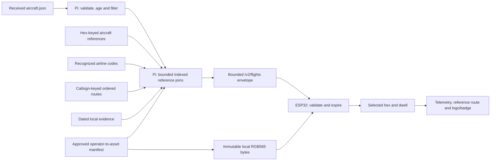

# Pi-to-ESP32 contracts

M1 draft **0.2**, updated 2026-10-04. The canonical flight feed and logo service
are proposed contracts. The diagnostic route API is implemented. An initial
local flight feed/parser exists, but follows [the prototype contract](../local-flight-api.md)
rather than M1. The prototype retains `/v1/flights` and `schema_version=1`;
the canonical draft reserves `/v2/flights` and `schema_version=2`.
Use this document as the entry point; field semantics live in the linked contracts
and machine-readable schemas. M2/M3/M6 must implement those definitions rather
than introducing a second simulator or firmware schema.

## 1. Contract map and implementation status

| Contract | Direction / consumer | Status | Detailed definition |
| --- | --- | --- | --- |
| Decoder snapshot | Existing readsb → Pi normalizer | Cached prototype file/HTTP reader exists; canonical progress/clock rules remain M2 | [Received-data inventory](../adsb-receiver-data.md), [flight normalization](flights.md) |
| `GET /v1/flights` | Pi → current ESP32 | Implemented flat prototype, preserved during migration | [Prototype](../local-flight-api.md) |
| `GET /v2/flights` | Pi → ESP32 and development preview | Canonical M1 shape pending | [Flight feed](flights.md), [producer schema](flights-v2.schema.json), [prototype](../local-flight-api.md) |
| `GET /assets/logos/{sha256}.rgb565` | Pi → ESP32 asset cache | Draft v1; approved assets/server/cache remain M6 | [Logo bytes and descriptor](logos.md), [descriptor schema](logo-v1.schema.json) |
| `GET /health` | Pi → local diagnostics | Legacy fields and prototype `receiver_status` implemented; canonical additions drafted | [Health and metadata](health-and-metadata.md) |
| `GET /v1/meta` | Pi → local diagnostics/maintenance | Existing FAA/route summaries implemented; general manifest additions drafted | [Health and metadata](health-and-metadata.md) |
| `GET /v1/aircraft/{hex}` | Pi → existing lookup consumers | Implemented legacy contract retained | [Legacy compatibility](legacy-compatibility.md) |
| `GET /v1/aircraft/live` | Pi → existing live consumers | Implemented legacy contract; route enrichment added | [Legacy compatibility](legacy-compatibility.md) |
| `GET /v1/routes/{callsign}` | Pi → diagnostic clients | Implemented; full route sequence and evidence | [Diagnostic routes](routes.md), [producer schema](route-resolution-v1.schema.json) |

The ESP32's routine work is one flight poll and, when needed, one approved asset
fetch. Health/meta/aircraft/route diagnostics are not additional per-plane polling
requirements. JSON from the preview on port 8090 is not the production feed.

## 2. End-to-end ownership

The Pi owns source reading, receiver state, normalization, filtering, reference
selection and candidate ordering. The ESP32 owns current-card selection, dwell,
final monotonic expiry and rendering. Reference maintenance runs separately from
both API startup and aircraft polling. [Join documentation](enrichment-joins.md)
explains which keys identify an aircraft, airline, route and asset.

## 3. Version and transport rules

- `schema_version=2` identifies the canonical flight-feed major version. It is unrelated to
  ADS-B `version`, VRS schema 1, the legacy metadata version or ESP32 settings version.
- Flight draft revision 0.2 (route/logo drafts 0.1) is documentation status, not a production capability claim.
  The v1 prototype remains compatible; M2/M3 must explicitly adopt canonical
  v2. Advertise canonical flights or logos only after their corresponding
  runtime exists.
- Producers emit documented keys and explicit nulls for unknown content. Schemas
  describe complete producer outputs and reject unexpected keys during checks.
  Consumers may ignore bounded unknown keys within a supported major version;
  adding fields still requires updating producer schemas/examples.
- Breaking field meaning, unit or type changes require a new major contract and
  migration path. An unsupported major cannot be interpreted as a live card.
- Initial base is `http://{configured_pi_host}:{configured_pi_port}`, normally
  port 8080. The ESP32 uses its persisted configured endpoint. This is a local
  LAN contract; internet flight endpoints are not fallbacks.
- JSON uses UTF-8, `Content-Type: application/json`, compact serialization and
  `Content-Length`. Initial producer responses use no content compression or
  chunked transfer. Polls request `Accept-Encoding: identity`.
- The flight client accepts HTTP 200 only for the flight JSON. It rejects redirects
  and unexpected encodings, bounds headers/body before allocation, and maintains
  its local expiry timers while a request is pending or failing.
- Successful domain responses can report stale/invalid/unavailable receivers.
  Those use HTTP 200 plus receiver state, with no normal flight cards.
  HTTP 4xx/5xx indicates a request/server/transport failure, not an empty sky.
- The live envelope includes source state needed by the wall. It must not fetch
  `/health` on every poll to decide whether `/v2/flights` is usable.

BLE provisioning is a local client→ESP32 contract for M5, not a Pi→ESP32 HTTP
endpoint. Wi-Fi passwords, pairing secrets and deployment paths do not belong in
these response bodies. Changes to the configured Pi invalidate queued responses
from the old connection; a Pi failure does not erase valid Wi-Fi credentials.

## 4. Common budgets

| Boundary | Draft limit | Behavior at the limit |
| --- | --- | --- |
| Local decoder JSON | 4 MiB, at most 512 rows | M2 reports invalid source when exceeded; this is not proof that normal input fits on the actual Pi. |
| Flight body | 16,384 UTF-8 bytes | Bound Content-Length and actual received bytes; serialize and measure on the Pi before sending. |
| Candidate rows | At most eight | Closest eligible prefix, hex tie breaker; byte limit can produce fewer than eight. |
| Reference-source rows | At most eight | Include only the approved sources needed by returned rows; IDs are local to this response. |
| Snapshot freshness | Strictly less than 5,000 ms | Frozen or expired receiver clears normal cards. |
| Aircraft/position freshness | Each strictly less than 15,000 ms | Exclude expired candidates independently. |
| HTTP request | Initially two seconds total | Keep expiry/rendering responsive; unsuccessful polling backs off to at most 15 s. |
| JSON nesting | Consumer depth budget 16 | Actual draft is shallower; unbounded recursive input is rejected. |
| Response headers | Consumer budget 4 KiB | Reject excess before body parsing. |
| Logo | Exactly 1,152 raw bytes | One 24×24 RGB565 bitmap; unexpected length/hash is a badge fallback. |
| Logo cache | Four entries / 4,608 pixel bytes | Hash-keyed bounded cache; additional task/parser/staging overhead must be measured. |
| Route CSV import | 64 KiB I/O, bounded rows, 1 MiB SQLite cache | Implemented streamed path; no worldwide Python dictionaries. |

Byte limits and cardinalities are distinct. Eight maximal rows are not guaranteed
to fit. The [flight contract](flights.md) specifies deterministic byte-budget
truncation, preserving complete fields for the retained prefix. Field character
limits alone are insufficient for UTF-8 byte or ESP32 heap guarantees.

The source and numeric limits remain draft choices pending receiver samples and
M3 parser/heap measurements. The known 160×32 RGB LED buffer alone is 15,360 bytes;
the HTTP body limit is not a total firmware-memory budget. Do not claim hardware
acceptance from schema checks or cloud memory measurements.

## 5. Examples and validation

[Synthetic M1 fixtures](../../tests/fixtures/m1/README.md) contain source snapshots,
proposed envelopes, clock/state contexts, compact-route cases and deliberately
invalid examples. Their expected outputs are design evidence; no M2 reader or
M3 firmware parser currently produces them.

The schemas use JSON Schema 2020-12. Their URN IDs are local identifiers;
validation must resolve all three schemas from the repository without internet
access. [Contract checking](validation.md) covers schema validity, fixture shape,
cross-field relationships and compact UTF-8 body size. Physical behavior and
receiver normalization need later replay/integration checks.
