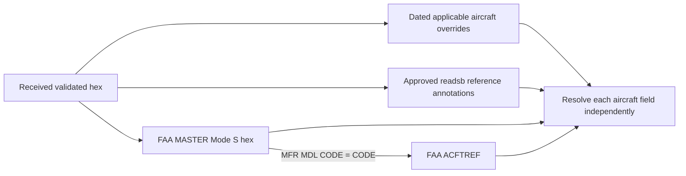
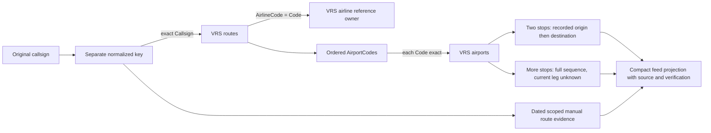

# Joining received aircraft to references, logos and likely routes

M1 draft **0.1**, 2026-10-03. The callsign-route importer/resolver is implemented;
the complete aircraft/operator/logo joins described here are the M4/M6 target.
This document defines evidence and join keys, not a claim of current-flight
accuracy. Ordinary ADS-B supplies telemetry/identifiers, not logo artwork or a
scheduled airport pair. See [received-data inventory](../adsb-receiver-data.md).

## 1. Keys and why they differ

| Entity | Key | What it identifies |
| --- | --- | --- |
| Received aircraft record | Strict uppercase six-character `adsb_icao` | A 24-bit address used by the transponder, not a universal flight-instance ID. |
| Aircraft registry row | `adsb_icao` / FAA Mode S hex | Registration/owner and applicable aircraft information. |
| FAA aircraft reference row | MASTER `MFR MDL CODE` → ACFTREF `CODE` | Aircraft manufacturer/model/classification relationship; not automatically an ICAO designator. |
| Airline reference | VRS `airlines.Code` | Canonical airline record, ICAO when present, otherwise IATA fallback. |
| Airline alias | Known `ICAO` / `IATA` | ICAO generally identifies one table row; IATA may identify multiple historical/carrier rows. |
| Local operator/asset identity | `airline:{canonical_code}` | Namespaced airline key resolved from applicable evidence, not arbitrary owner text. |
| Route reference | Exact normalized `routes.Callsign` | Usual/reference ordered itinerary for that identifier, without a flight date. |
| Airport reference | Exact `airports.Code` | VRS airport record: ICAO or IATA fallback. Do not join blindly on display IATA labels. |
| Dated route override | Normalized callsign + UTC flight date + optional aircraft hex + validity window | Bounded manual evidence for a date/aircraft scope. |
| Logo manifest | Exact resolved `operator_id` | Approved operator→content-hash mapping, independent of route and ownership. |
| Logo asset | SHA-256 of converted bytes | Immutable 1,152-byte bitmap. Hash changes when pixels change. |

Callsigns/addresses can be mistyped, reused or reassigned. A successful join
identifies the source record; it is not proof of today's operating airline,
schedule, diversion status or actual airport event.

## 2. Normalization boundary

Keep received data distinct from lookup keys:

1. Validate `hex` against exactly six hexadecimal characters, then uppercase.
   Do not remove a `~`, discard punctuation, or zero-pad a malformed address.
2. Keep the original received callsign (up to eight radio characters) separately.
   Trim padding/uppercase only for lookup/display handling; do not overwrite it.
3. Split lookup callsign into the documented VRS prefix and digit-led number/suffix.
4. For IATA prefixes, map only through an unambiguous known airline row.
   For ICAO prefixes, use recognized rows; an exact licensed three-letter route
   key can still match when its prefix is missing from the companion airline index.
   That exception does not by itself invent a displayed operator/logo identity.
5. Strip leading numeric zeros, retaining one zero if only letters/emptiness
   remain. Validate the suffix rather than truncating arbitrary text.
6. Perform exact indexed lookup; preserve an unknown result when syntax or alias
   mapping is ambiguous. Never manufacture a passenger flight number from an
   operational alphanumeric callsign.

| Received/lookup example | Normalized key | Meaning |
| --- | --- | --- |
| `BAW117  ` | `BAW117` | ICAO operational callsign, padding removed for lookup. |
| `BA117` | `BAW117` | Only when the BA→BAW alias is unique/applicable. |
| `EZY0001` | `EZY1` | Leading-zero normalization. |
| `EZY00AB` | `EZY0AB` | Keep a digit before the alphabetic suffix. |
| `U21234` | `EZY1234` | Known unambiguous U2→EZY substitution. |
| `BAW3YA` | `BAW3YA` | Preserve operational alphanumeric suffix; not invented BA3. |
| Registration-only or ambiguous alias | null / unmatched | Useful telemetry remains; operator/route may be unknown. |

Full accepted pattern and examples come from the VRS schema linked in
[route research](../route-detection.md). For a known callsign with no route row,
airline attribution can still succeed independently through a recognized prefix.

## 3. Aircraft-reference join



Proposed per-field precedence is applicable explicit dated override, then approved
readsb reference annotation, then the approved registry/reference bundle. Missing
or inapplicable sources do not win merely because they have a higher priority.
Each returned field records the source ID that actually supplied it.

| Output field | Applicable source relationship | Restriction |
| --- | --- | --- |
| Registration | Registry address→registration; readsb `r` only with known source | Keep reference identity distinct from original transmitted callsign. |
| Registered owner | MASTER owner/name | Do not put this into operator/airline identity. |
| Manufacturer/model | MASTER model code→ACFTREF make/model | Do not use unrelated MASTER code text as a model name. |
| FAA classification | Applicable FAA classification columns | Keep as its own code; not `B738`, `A320` etc. |
| ICAO type designator | Approved explicit type mapping/readsb `t` | Do not infer a unique ICAO designator from generic make/model text or emitter category. |

The existing FAA importer has not implemented the ACFTREF join or corrected all
legacy owner/type semantics. This plan must not mark those fields as implemented
because an older API contains an `operator_name` or `aircraft_type` string.

## 4. Airline/operator join

The operating/reference airline is resolved independently of aircraft ownership.
Candidate procedure:

1. Check an applicable dated operator override, with its scope/source/expiry.
   Trusted UTC is needed to evaluate validity; do not use an expired correction.
2. Otherwise parse the received operational prefix and match a recognized ICAO
   airline record, or a unique IATA alias to its canonical airline record.
3. Preserve `match_kind="callsign_reference"`; prefix recognition is a reference
   association, not proof of the actual operator for this flight.
4. Form `operator.id="airline:" + airline.Code`; attach available name/ICAO/IATA
   and the airline generation's source ID. A namespaced ID prevents aircraft
   registrations or owner strings becoming image filenames.
5. If ambiguous/unrecognized, emit the complete unknown operator object with
   null identity/name/codes/source and keep the aircraft's core telemetry.

Routes contain `AirlineCode`, the owning airline **of that reference record**.
It joins `airlines.Code` to interpret the route owner, not to certify today's
operating carrier. Use it as a consistency check with the independently resolved
operator. A conflict is diagnostic; do not silently select an owner/marketing
brand to conceal the disagreement. An explicit dated rule is needed to resolve
wet leases, regional branding, codeshares or historic code reuse where relevant.

No operator inference is made from squawk, registration country, hex prefix,
manufacturer, model, or registered-owner name. Marketing aliases can help manual
Google searches but do not prove that an operational callsign has that flight number.

## 5. Airline logo join


The join is **operator identity → approved asset manifest → content hash**.
There is no automatic implication that VRS supplies artwork. Its airline file
contains names/codes and optional flight-pattern fields; it has no logo field.
Neither a VRS CC0 dedication nor the license of an API's software licenses a
separately obtained airline image.

A manifest row records the exact `operator_id`, source asset URL/revision/hash,
artifact-specific approval/license/attribution, conversion recipe/version, raw
bitmap hash/dimensions/byte order and activation generation. Only approved,
validated converted assets can project a non-null feed descriptor.

Example join with illustrative asset metadata:

```text
received flight       BAW117
airlines.Code         BAW
airlines.ICAO/IATA     BAW / BA
operator.id           airline:BAW
manifest.operator_id  airline:BAW
manifest.raw_sha256   <64 lowercase hex digits for approved converted bytes>
feed.logo.path        /assets/logos/<same hash>.rgb565
```

If the airline is recognized but no approved manifest row exists, `operator`
can be populated while `logo=null`. If the image request fails or validates
incorrectly, the ESP32 renders a text/neutral badge and continues telemetry.
It must not search the internet or construct an arbitrary external image URL.

When operator evidence expires/changes, the card drops the old association even
if those bytes remain in the hash cache. A logo for a prior operator is not reused
for the new one merely because the aircraft hex stayed the same.

See [logo contract](logos.md) for exact descriptor, pixel bytes, HTTP behavior,
memory budgets, manifest contents and update/retention rules. This join and asset
service remain M6 implementation work.

## 6. Likely/reference departure and destination join



The implemented SQLite relationships are equivalent to:

```sql
SELECT airport_codes, airline_code
FROM routes
WHERE callsign = :normalized_callsign;

SELECT code, name, icao, iata, latitude, longitude
FROM airports
WHERE code = :one_ordered_airport_code;

SELECT code, name, icao, iata
FROM airlines
WHERE code = :route_airline_code;
```

The route sequence is stored/validated in order. Do not sort airport codes,
join airports by name, or interpret a hyphenated pair as undirected endpoints.
The VRS schema explicitly records the order in which airports are flown.

At verified source revision `d856ef1ed0fc492e8a3933ff4a938448ed008f66`:

```text
BAW117 → EGLL-KJFK
EGLL → ICAO EGLL, IATA LHR, London Heathrow
KJFK → ICAO KJFK, IATA JFK, John F Kennedy International
reference departure → EGLL (display LHR)
reference destination → KJFK (display JFK)
flight_instance_verified → false
```

This gives the likely/usual direction for a matching overhead flight without
observing any local landing. It is not dated confirmation of this flight's
intended destination or actual arrival. The data has no per-row schedule date or
last-verified time. An import done today can contain an old route.

For a sequence such as `A-B-C`, the whole route could describe multiple legs.
Without separate active-leg evidence, leave both current-leg endpoint fields
null and mark ambiguity. Do not select the closest pair based on heading alone.
The diagnostic endpoint retains up to 128 airport codes; the compact feed sends
at most eight, or omits that long array with an explicit full stop count. Neither
representation invents an active leg or discards the complete stored source sequence.

## 7. Dated overrides, plausibility and observed events

Resolve the reference and dated override independently. For a currently applicable
override, match normalized callsign, UTC flight date, optional strict aircraft
hex and validity interval. Keep full evidence/source in the separate local DB.
The preferred route can name an override while still exposing the VRS reference
for transparency. Callsign/date-only corrections remain unverified; aircraft-
specific explicit dated verification can be marked verified while its scope/window
and trusted-clock conditions hold. Remaining validity lets the ESP32 expire it
without NTP. A dated finding can still be superseded by a diversion.

Position can reject an obviously unrelated reference using the documented
great-circle excess check. A plausible match does not prove the date, direction,
active leg or actual destination. The route does not need a locally observed
takeoff/landing; about 95% of the user's overhead traffic will not land locally.

`observed_departure_airport` / `observed_arrival_airport` remain separate fields.
Only a later M8 detector with suitable continuous ground-transition evidence can
populate them. An airport appearing in the VRS route or near the latest position
is not an observed airport event.

Manual Google/airline status lookup is useful dated evidence. No free supported
Google flight-card API was verified; no scraping or per-flight WAN service is
introduced into this offline join. API/provider license distinctions are retained
in [route research](../route-detection.md).

## 8. Memory, generations and failure behavior

Only the bounded eligible candidate set is enriched. Prepared data remains in
indexed SQLite: hex, airline/alias, normalized callsign and airport code indexes.
Do not materialize worldwide airline/airport/route dictionaries on either device.
The implemented VRS path streams imports and uses 1 MiB page caches with mmap
disabled; preserve those rules when adding the logo/operator joins.

Pin a compatible reference generation while building one feed. Different
component generations are identified separately in the source table; a response
must not silently combine incompatible airline-code/logo-manifest mappings.
Publish DB/manifest/notices/assets together for each validated component, finalize
WAL state, retain the last valid generation and keep overrides separate. Maintenance
is explicit and never gates startup. Unknown or failed reference joins produce
null fields plus independent reference diagnostics, not removal of live telemetry.

Approved assets are converted one at a time during maintenance with bounded source
dimensions/bytes. The ESP32 receives only a 1,152-byte bitmap/descriptor and the
bounded flight response, not the airline or route dataset.

## 9. Evidence still needed

| Item | Current evidence / remaining work |
| --- | --- |
| Route lookup/storage | Implemented; source examples, regression and network-disabled lookup evidence recorded. |
| Airline names/codes | Imported for route normalization; canonical operator projection still needs M4 integration. |
| Logos | No approved artwork pipeline/manifest/server/firmware cache yet; this is the joining contract. |
| Aircraft attributes | Existing FAA lookup remains; semantic corrections and ACFTREF join pending. |
| Route usefulness | Dataset matches proven; actual overhead match rate and dated correctness unmeasured. |
| Pi/ESP32 resources | Cloud route measurements available; real decoder/API/heap/latency evidence remains M0/M3/M7. |
