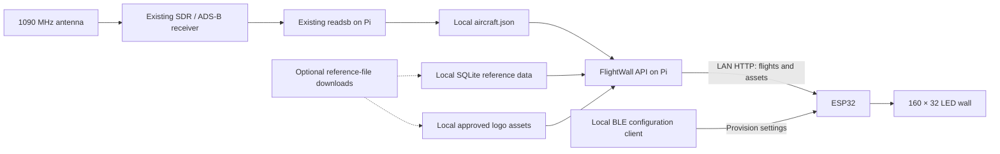

# FlightWall implementation plan

Prepared October 1, 2026. This is a build plan; it does not claim the listed features have been implemented or deployed.

**Target outcome**

A 160×32 LED wall displays aircraft received by your own ADS-B receiver. Your Raspberry Pi supplies all flight information, reference lookups, and display assets over the LAN. The ESP32 connects only to the Pi. Wi-Fi credentials, Pi hostname/address, and HTTP port can be changed over Bluetooth LE without reflashing.

Your Pi already runs readsb installed through wiedehopf's tooling. Use that installation. Target the Pi 5 with 1 GB RAM first; move to the Pi 4 with 4 GB only if measured memory pressure, swapping, or decoder performance justifies it. The README describes twenty 16×16 WS2812B panels in a 10×2 arrangement, an ESP32/R32 D1 board, and a separate LED power supply. Confirm the actual board and panel wiring before flashing or changing electrical connections.

**Local data architecture**



The antenna requires a receiver/SDR before readsb can decode its signals; this receiver chain is already present in your setup. Keep aircraft telemetry acquisition separate from reference-data maintenance:

- **Live operation:** readsb → local FlightWall API → ESP32. No OpenSky, AeroAPI, FlightWall CDN, public aircraft APIs, or per-flight web lookups. No dependency on an internet connection for displaying received aircraft.
- **Maintenance:** explicit or scheduled downloads of free/open reference files and approved image files. Import them locally. Do not substitute external API queries for downloadable files. Maintenance failures retain the last valid dataset and never block the server from starting.
- **First setup:** normal software/package installation may need internet access. Once software and reference files exist locally, demonstrate operation with WAN disconnected and LAN active.
- **Receiver scope:** show aircraft your receiver actually hears. Do not add remote aggregation feeds or MLAT-network dependencies. Tar1090 can remain a diagnostic UI; the wall must work without its map or external map tiles.

**What can be displayed reliably**

| Requested item | Source and behavior |
| --- | --- |
| Flight identifier | Received callsign from readsb `flight`; trim padding and retain the original identifier. `UAL123` can resolve to United, but its commercial/codeshare flight number is not universally recoverable. Show the callsign unless a separately sourced mapping is available. |
| Airline name/logo | Match a recognized airline ICAO prefix against a local airline table, then select a local logo by that operator code. This identifies the operating airline; regional carriers and codeshares can differ from the marketing brand. Unknown or ambiguous matches get a neutral text badge. |
| Aircraft type/model | Look up the airframe's six-character ICAO hex address in local reference data; use readsb's locally enriched `t`, `r`, and `desc` fields when present. The ADS-B emitter category is not an aircraft model. |
| Altitude | Preserve readsb `alt_baro` in feet; store `alt_geom` separately. Handle `"ground"` explicitly rather than coercing it to a number. Prefer a clearly labeled barometric altitude for the normal card. |
| Ground speed | readsb `gs`, in knots. Display as `GS`. |
| Airspeed | readsb `ias`/`tas`, in knots, when actually decoded. Display as `IAS`/`TAS`; leave absent values unknown. Ground speed is not a substitute for airspeed. |
| Vertical speed | readsb `baro_rate` or `geom_rate`, in feet/minute, with the selected source identified. Preserve climbing/descending sign. |
| Departure/destination | Optional local overrides or labeled observations/inferences. Ordinary ADS-B identification/position/velocity messages do not contain the flight itinerary. Do not promise complete routes from this receiver alone. |

The decoder's [JSON documentation](https://github.com/wiedehopf/readsb/blob/dev/README-json.md) describes telemetry units, optional fields, callsigns, receiver timestamps, and database-enriched aircraft fields. Optional information must remain absent/null when not received or not found; a partial aircraft record is still useful.

**Existing code to reuse and gaps to close**

| Component | Current state | Required work |
| --- | --- | --- |
| Pi receiver | You confirmed readsb is already decoding aircraft. | Discover the existing JSON path and service settings; verify freshness and avoid a second SDR owner/decoder. |
| `pi_enrichment/server.py` | SQLite aircraft lookup, health/metadata, and a local readsb/tar1090 adapter exist. | Its live response currently omits altitude, speed, vertical rate, and receiver freshness. Add the canonical flight API and distinct receiver status. |
| `pi_enrichment/faa_pipeline.py` | FAA download/import exists; current working tree selects MASTER records. | Join MASTER's aircraft make/model code to ACFTREF. Separate registered owner from operating airline. FAA Type Aircraft is a broad classification, not `B738`/`A321`. Preserve the existing importer fixes and tests. |
| `firmware/src/main.cpp` and `core/FlightDataFetcher.cpp` | Live execution still uses OpenSky → AeroAPI → CDN/local enrichment. Aircraft are skipped without callsigns or successful flight lookups. | Replace that orchestration with one Pi flight feed; display useful partial records without external fallback. |
| Firmware configuration headers | Credentials, server URLs, location, and display preferences are compiled in. | Add validated persistent runtime settings and BLE setup/update. The Pi URLs marked as stubs are not a working local-flight implementation. |
| `firmware/models/FlightInfo.h` | Has route/model/logo fields, but no display telemetry fields. | Add nullable altitude, speed, vertical-rate, freshness, and provenance information. |
| `adapters/NeoMatrixDisplay.cpp` | Three-line card is centered on airline/route/type. Logo metadata currently triggers a text badge. | Render telemetry and actual local bitmap assets; retain text fallback. |
| `flightwall_sim/`, Docker fixture stack | Synthetic enrichment flow and JSON display cards exist. | Use the same flight contract as production and add realistic telemetry/replay fixtures. Existing smoke tests do not establish a working Pi→ESP32→LED path. |
| Wokwi | Mock flight mode, wiring, and firmware paths exist. | Validate matrix part/pins and fix the mismatch between tiled physical mapping and the single simulated matrix; add a full-size display option. |

**Reference data policy**

1. **Aircraft:** extend the existing [FAA downloadable registry](https://www.faa.gov/licenses_certificates/aircraft_certification/aircraft_registry/releasable_aircraft_download/index.cfm) for US-registered aircraft. Its [file documentation](https://registry.faa.gov/database/ardata.pdf) explains the aircraft-reference relationship and broad type classifications. This is useful regional coverage, not a worldwide registry.
2. **Airlines:** begin with a locally stored, versioned copy of [OpenFlights airline data](https://github.com/jpatokal/openflights/blob/master/data/airlines.dat), carrying its [ODbL license](https://github.com/jpatokal/openflights/blob/master/data/LICENSE). Add dated local corrections for stale codes, regional operators, mergers, and special callsigns. Do not interpret its static route data as a current flight-number itinerary service.
3. **Alternative airline mapping:** a curated subset of [Wikidata structured data](https://www.wikidata.org/wiki/Wikidata:Licensing) is CC0. If used, import an existing file or an offline subset prepared on a workstation; do not require the Pi to process a complete Wikidata dump or query a public API.
4. **Worldwide aircraft coverage:** evaluate [tar1090-db](https://github.com/wiedehopf/tar1090-db) or another downloadable hex→aircraft dataset only after verifying the exact data artifact's source and reuse terms. Readsb's open-source license does not establish a database's license. A public GitHub repository alone is insufficient evidence. Unknown aircraft remain displayable while coverage is expanded.
5. **Airports:** [OurAirports](https://ourairports.com/data/) offers public-domain downloadable airport files. Use local coordinates/codes for optional observed airport association. Airport reference data does not reveal a particular flight's route.
6. **Logos:** approve assets individually with source URL, license/public-domain basis, attribution, and modification notes. [Wikimedia Commons licensing](https://commons.wikimedia.org/wiki/Commons:Licensing) is a useful starting point, but check each file and applicable brand restrictions. The public [Airframes airline-images repository](https://github.com/airframesio/airline-images) is a discovery candidate; this review did not establish blanket reusable licensing for its images. Omit assets without clear reuse terms and render a neutral operator-code badge. Free downloading is not equivalent to freely licensed artwork.

Each imported dataset/asset needs a small manifest recording source, version/date, checksum, license, and required attribution. Retain license notices with redistributed data. Updates should import into staging, validate, and activate atomically; do not mutate the live database in place during an import. Start with an explicit update command, then add a daily/weekly timer appropriate to each source.

**Ordered implementation milestones and prompts**

Use one prompt at a time in this repository. Each milestone should end with a reviewable change and the stated validation. Preserve unrelated working-tree changes. Do not deploy to the Pi or flash hardware unless that action is requested for the implementation task.

**1. Verify the receiver connection and freeze a common API contract**

Inspect the existing Pi readsb service remotely when access is available. Record the JSON output path, receiver coordinates, configured SDR, service user, and any current local web endpoint. Prefer reading the local JSON file directly in the Pi service; retain a configurable loopback HTTP adapter if needed. Do not assume the repo's default `/tar1090/data/aircraft.json` URL matches the installation.

Define `GET /v1/flights`, `GET /health`, and same-origin logo asset paths on one configurable HTTP port, initially 8080. Keep the existing aircraft-lookup endpoint for compatibility. The flight response includes schema version, API generation time, original receiver snapshot time, receiver status, and a bounded flight list. A valid snapshot containing zero aircraft must differ from a stopped/missing/frozen receiver.

Use explicit unit names such as `altitude_baro_ft`, `ground_speed_kt`, `airspeed_ias_kt`, `airspeed_tas_kt`, and `vertical_speed_fpm`. Include `vertical_speed_source`, `last_seen_at`, `position_seen_at`, operator-resolution source, aircraft-reference source, logo ID/version, and nullable route fields. Retain the received callsign independently of any derived display identifier. Add synthetic complete, partial, ground, unknown, stale, and malformed fixtures. Firmware must bound response bytes and candidate count.

**Done when:** the schema, fixture responses, and receiver handoff instructions are unambiguous; API and ESP32 implementers can use the same examples.

```text
Read docs/flightwall-local-plan.md and inspect the current Pi service, simulator, and ESP32 models. Define and document the versioned local FlightWall API contract and create representative fixtures plus a JSON Schema. Include callsign, aircraft ICAO hex, local airline/type/logo metadata, nullable altitude/GS/IAS/TAS/vertical rate with explicit units, source timestamps, and receiver status. Distinguish healthy-empty from stale or unavailable receiver data. Keep /v1/aircraft/{hex} compatible and choose one port for flight JSON and logo assets. Add safe receiver-discovery instructions for the existing readsb installation; do not reinstall the decoder. No external API calls or deployment. Preserve unrelated edits.
```

**2. Add persistent runtime configuration and BLE provisioning**

Persist Wi-Fi SSID/password, Pi host and port, and mutable display settings using ESP32 [Preferences/NVS](https://docs.espressif.com/projects/arduino-esp32/en/latest/api/preferences.html). Keep physical wiring constants as hardware configuration unless there is a clear reason to expose them. BLE must work before Wi-Fi is configured and when the Pi is unreachable.

Prefer Espressif's supported provisioning/security mechanisms where compatible with the project's pinned Arduino/PlatformIO toolchain. Add custom configuration support for Pi host/port; stock Wi-Fi provisioning alone does not satisfy this requirement. Provide an open-source local reference client that can actually send both Wi-Fi and custom settings. Use a per-device proof of possession or authenticated pairing and a physically enabled, time-limited setup window. Never read back or log passwords. [Espressif's provisioning guide](https://docs.espressif.com/projects/esp-idf/en/stable/esp32/api-reference/provisioning/provisioning.html) describes secure provisioning and proof of possession.

Validate and stage changes before committing. A failed Wi-Fi change should retain the last working credentials. Report Pi endpoint failure separately from Wi-Fi failure so a valid network remains usable while the Pi is down. Provide a setup/reset recovery path after repeated connection failures. Handle BLE message size/fragmentation and Wi-Fi coexistence. Changing the ESP32's saved port changes where it connects; the Pi's listening port is configured separately in its service settings.

**Done when:** on a real ESP32, Wi-Fi and Pi host/port can be changed without reflashing, survive reboot, and recover from invalid input. Wokwi does not simulate Bluetooth; test BLE on hardware. [Wokwi ESP32 support](https://docs.wokwi.com/guides/esp32).

```text
Implement persistent ESP32 configuration and Bluetooth LE provisioning described in docs/flightwall-local-plan.md. Inspect and pin the current PlatformIO/Arduino dependencies before choosing supported provisioning APIs. Save Wi-Fi credentials, Pi host/HTTP port, and display preferences in versioned NVS settings. Support initial setup and later changes without reflashing, including when Wi-Fi/Pi are unavailable. Include authenticated provisioning, a physical/time-limited setup mode, bounded input and fragmented BLE messages, staged writes, last-working Wi-Fi recovery, and a documented reset path. Supply an open-source local configuration client that also handles custom Pi settings. Do not log or expose passwords. Test pure validation/persistence logic locally and provide real-ESP32 BLE acceptance steps; do not claim Wokwi validates BLE.
```

**3. Turn readsb snapshots into the production Pi flight API**

Extend the existing Python service instead of creating another unrelated server. Poll/cache one receiver snapshot roughly every second; serve that snapshot to clients without rereading the decoder for every request. Preserve the source's `now` and `seen`/`seen_pos` values, and expire data based on source time, not the time a response was served.

Normalize telemetry; handle absent keys, `alt_baro: "ground"`, invalid position, unavailable reference data, and invalid/pseudo hex addresses. A fresh receiver snapshot with no aircraft is normal. Reject frozen/old snapshots. Begin with configurable defaults around 5 seconds for snapshot staleness and 15 seconds for aircraft/position eligibility, then tune against observed decoder output.

Filter by center/radius, optional view bearing and altitude, and fresh position. Default center should come from confirmed receiver coordinates or saved user settings; the firmware's San Francisco example must not silently become the real installation location. Return a capped candidate list, initially up to eight aircraft ordered by distance. Maintain selected aircraft by hex for a minimum dwell period, initially about five seconds, so packet-to-packet ordering changes do not make the card flicker. Use polling rather than adding WebSockets to the first version.

**Done when:** replay tests validate units, partial data, stale snapshots, position freshness, geographic filtering, capped output, and healthy-empty versus receiver failure. Live Pi readings match readsb.

```text
Implement the canonical /v1/flights endpoint from docs/flightwall-local-plan.md in the existing pi_enrichment service. Read the configured local readsb aircraft.json path or an explicitly configured loopback endpoint, cache snapshots, normalize optional telemetry and ground status, and preserve original source timestamps. Add receiver freshness checks, geographic/bearing/altitude filters, bounded result count, and meaningful health states. Do not discard aircraft merely because a callsign or reference lookup is missing. Use replay fixtures to test partial data, stale/frozen snapshots, malformed files, geographic boundaries, and an empty but healthy receiver. Keep the server operational without a registry DB or internet and retain compatible existing aircraft lookups. No external service fallback.
```

**4. Complete aircraft model/type enrichment**

Fix the registry relationship before adding more sources: import MASTER and ACFTREF, join the make/model code, and store manufacturer/model/series and the FAA classification separately. Keep registered owner as `registered_owner`; do not use it as the flight's airline. Where readsb already supplies locally enriched type/registration, retain provenance and choose a documented precedence for conflicts.

Store local overrides separately from downloaded tables. Add worldwide aircraft reference data only when its actual license/provenance is verified. Stream imports and use SQLite indexes rather than loading full datasets into RAM on the 1 GB Pi.

**Done when:** a realistic FAA fixture with MASTER+ACFTREF resolves the aircraft model correctly; owner does not replace callsign-derived airline; unknown and non-US aircraft retain usable telemetry.

```text
Extend the existing FAA importer and local aircraft enrichment according to docs/flightwall-local-plan.md. Preserve current MASTER-selection fixes and regression tests. Parse ACFTREF and join MASTER aircraft make/model codes to obtain manufacturer/model/series. Separate registered_owner, FAA aircraft classification, and ICAO type designator; never use owner as the operating airline or classify a FAA numeric code as B738/A321. Support readsb local type/registration metadata and explicit local overrides with documented precedence and provenance. Use streaming imports, indexed SQLite lookups, and atomic validated dataset activation. Add realistic join, unknown-code, partial-data, and source-conflict tests. Only add another downloadable dataset after verifying its exact reuse terms; no public API queries.
```

**5. Resolve airline identity and flight labels locally**

Import approved airline reference files into SQLite. Trim/uppercase the received callsign, recognize prefixes only when present in the local operator table, and preserve alphanumeric identifiers. Include dated overrides for nonstandard identifiers and regional carriers. Keep a confidence/source marker. An unknown registration-like callsign must not be assigned an airline merely because its first three characters resemble a prefix.

Use the received callsign for the first release's flight label. An optional ICAO→IATA prefix substitution can be labeled a derived identifier; it does not prove the marketed flight number. Do not obtain airline identity from registered owner.

**Done when:** airline, general aviation, regional carrier, alphanumeric, ambiguous, and unknown cases resolve deterministically and carry their source.

```text
Implement offline airline resolution in the Pi service using the approved downloadable airline reference files in docs/flightwall-local-plan.md. Record dataset license/version/checksum and carry attribution. Resolve recognized ICAO operator prefixes from trimmed callsigns, preserve the received callsign and alphanumeric suffix, and add dated local overrides for special and regional operators. Keep registered owner separate and handle unknown/ambiguous or registration-like identifiers with a neutral fallback. Do not claim that an ICAO-to-IATA prefix conversion establishes a marketed/codeshare flight number. Add representative resolver tests and expose resolution provenance through /v1/flights. All lookups must use local data, with no per-flight web requests.
```

**6. Build the local logo library and bitmap pipeline**

Prioritize operators commonly received locally. For each logo with clear reuse terms, keep the source image and manifest on the Pi. Convert approved sources during maintenance into small display-ready RGB565 assets, initially 24×24 pixels, with a documented black background/alpha policy and explicit byte order. Avoid asking the ESP32 to parse SVG or full-resolution PNG files.

Serve assets and flight JSON on the same host/port. Return a relative asset path, asset version/hash, dimensions, and format. Cache a bounded number of assets on the ESP32; never download the same logo every frame or accept arbitrary external asset URLs. Unknown/unapproved operators get a rendered text badge instead of a claimed airline logo.

**Done when:** locally approved logos can be served without WAN, generated assets have correct dimensions/colors, and missing/corrupt assets produce a readable fallback.

```text
Build the offline airline-logo workflow described in docs/flightwall-local-plan.md. Define a manifest keyed by operator ICAO code with source URL, exact reuse license/public-domain basis, attribution, checksum/version, and conversion notes. Include only individually approved assets; a public logo repository is not blanket permission. Supply an importer/converter for approved local source files and generate documented 24x24 RGB565 display assets with explicit byte order and background policy. Serve assets from the Pi's existing HTTP port and expose relative path/version/dimensions in flight responses. Add a neutral operator badge fallback and tests for invalid manifests, corrupt assets, pixel conversion, and missing logos. Do not fetch images during flight requests or add a CDN dependency.
```

**7. Replace the ESP32 cloud data path with the Pi feed**

Introduce a dedicated Pi flight-feed adapter that reads runtime settings. The local response already combines received telemetry and offline enrichment, so do not preserve the per-aircraft OpenSky/AeroAPI lookup sequence in the local production path. Keep external adapters excluded from or unreachable in that build; do not silently fall back to them after a LAN failure.

Poll roughly every one to two seconds with bounded HTTP timeouts, payload limits, parser limits, and retry backoff. Keep networking separate from card dwell/refresh so slow HTTP cannot repeatedly stall display behavior. Store the selected hex across reordered responses. Compare receiver/source age and clear stale cards. Missing airline/type/logo/airspeed/route information must not suppress a valid flight.

**Done when:** firmware consumes complete and partial fixtures, talks only to its configured Pi endpoint, and displays explicit Wi-Fi/Pi/receiver/no-aircraft states without external fallback.

```text
Implement the production Pi flight-feed adapter in the ESP32 firmware using docs/flightwall-local-plan.md and the shared /v1/flights fixtures. Replace live OpenSky/AeroAPI/CDN orchestration with the configured Pi host/port from runtime NVS settings. Extend FlightInfo for nullable telemetry, freshness, and local logo metadata. Bound HTTP timeouts, response sizes, parsing memory, and candidate count; add retry/backoff without repeatedly blocking display cycling. Preserve selection by aircraft hex and render useful partial records, including aircraft without callsigns. Distinguish Wi-Fi disconnected, Pi unavailable, receiver stale, and healthy no-aircraft states. Ensure the local production build has no external network fallback. Build the physical and simulator environments and test parsing/error behavior against shared fixtures.
```

**8. Update the LED card and Wokwi verification path**

Use the physical 160×32 layout. Reserve a small logo area; show callsign and aircraft type on the first text line, altitude/GS on the second, and signed vertical speed plus IAS or TAS when available on the third. If width is insufficient, use a second detail page; never change metric labels to conceal missing data. Routes can occupy an optional later page.

Add readable setup, no-aircraft, receiver-stale, and Pi-unavailable states. Add a pixel-coordinate diagnostic to verify actual tiled wiring. Retain the compact 64×32 Wokwi fixture for quick tests, plus a 160×32 option for text/logo layout. Wokwi's [documented LED matrix](https://docs.wokwi.com/parts/wokwi-led-matrix) uses a row layout; match simulated pixel indexing rather than blindly using the physical tile mapping.

Use local fixtures for deterministic simulator rendering. Wokwi is a development tool with cloud-backed features; the deployed wall must not depend on it or a Wokwi license. Optional Wokwi→local-Pi tests need gateway support, while physical ESP32 tests can directly use the LAN. Verify power/brightness limits against the actual supply and wiring before full-wall tests; the README's supply recommendation is not a measured budget for every pattern.

**Done when:** corners, rows, tiles, logos, units, missing values, and state screens render correctly in simulation and on the physical panel. BLE is validated separately on hardware.

```text
Update NeoMatrixDisplay and Wokwi fixtures for the local FlightWall design in docs/flightwall-local-plan.md. Render actual locally supplied RGB565 logos plus callsign/type, barometric altitude, GS, signed vertical speed, and optional clearly labeled IAS/TAS on the 160x32 wall. Provide a readable code badge and unknown-value fallback, stable aircraft selection, and setup/no-aircraft/Pi-down/receiver-stale screens. Add a pixel-coordinate diagnostic. Validate the Wokwi matrix part/pins and use a simulator mapping matching its row layout; retain a compact fixture and add a full-size one. Use shared deterministic flight fixtures and bounded asset caching. Build and visually verify available environments, and document physical panel mapping/power checks and real-hardware BLE tests without claiming simulation proves either.
```

**9. Deploy and prove offline operation on the Pi 5**

Keep one receiver process and one lightweight FlightWall API service. Adapt existing systemd units to the actual Pi username, paths, permissions, and service dependencies instead of assuming user `pi`. Prefer direct readsb JSON input and avoid a full global dump or map stack in the wall's critical path. SQLite may live under `/var/lib/flightwall`; the decoder snapshot stays in its existing location. Reference maintenance runs separately.

Add restart behavior, capped logs, metadata/freshness diagnostics, and a documented backup of settings, overrides, data manifests, and assets. Start the API even if the internet or a reference download is unavailable. Stable DHCP reservation/hostname is sufficient initially; optional mDNS service discovery can later advertise the API port. Changing the Pi service's listening port does not change stored ESP32 settings automatically.

**Acceptance checklist:**

- Real received aircraft appear within about three seconds of a fresh decoder snapshot under normal LAN conditions.
- The wall keeps operating with WAN disconnected and LAN active.
- Flight operation emits no external API/CDN requests; maintenance is disabled during the offline verification.
- Credentials and host/port survive an ESP32 restart; invalid Wi-Fi settings have a recovery path.
- Pi/ESP32/receiver restart, Wi-Fi loss, empty sky, and frozen JSON produce distinct correct behavior.
- Unknown type/operator/airspeed/logo/route fields do not blank a useful flight.
- Stale receiver data disappears or is clearly indicated within the configured threshold.
- A changed Pi listening port can be applied to the ESP32 over BLE without reflashing.
- During a 24-hour run, record Pi RAM/swap/CPU, decoder health, API latency, and ESP32 free heap. If swapping or dropped decoder samples occurs, first reduce imports/logging/other services, then consider the Pi 4 with 4 GB.

**Done when:** installation and recovery are reproducible and the checklist is evidenced on hardware. Do not report a Docker JSON test as physical acceptance.

```text
Prepare the Pi 5 deployment and end-to-end acceptance workflow from docs/flightwall-local-plan.md using the existing readsb installation. Adapt systemd files for the actual service user/paths, local decoder input, configurable HTTP port, least-required permissions, restart behavior, bounded logs, and separate reference updates. Startup must use cached data and never wait for WAN downloads. Update Docker/replay tooling to the shared production API contract. Add reproducible checks for source freshness, healthy-empty states, Wi-Fi/Pi/decoder failures, BLE host/port changes, reboot persistence, and operation with WAN disconnected and LAN active. Document how to verify no external runtime requests and collect a 24-hour RAM/swap/CPU/latency/ESP32-heap baseline. Produce deployment files and instructions; apply them only when deployment access and authorization are provided.
```

**10. Add optional airport observations and route overrides**

Keep this after the core wall works. Import a local airport file and build bounded short-term track history. Infer a departure only when the receiver actually observes a plausible takeoff near an airport. A local arrival observation can identify the airport reached; it cannot reliably predict every overflight's intended destination. Separate `observed`, `inferred`, `manual`, and `unknown` route sources. Heading toward an airport alone is insufficient.

Support manually maintained callsign+validity-period route overrides if useful. Require dates and direction/leg distinctions, because callsigns and flight numbers are reused and schedules change. Do not promise worldwide accurate routes or add a hidden schedule API, live website scraper, or stale global route table.

**Done when:** confident local cases display their source and validity, and other flights retain an honest unknown route.

```text
Add optional local airport association and route overrides after the core milestones in docs/flightwall-local-plan.md are complete. Import an approved downloadable airport file such as OurAirports into local storage. Use bounded received track history to identify plausible observed takeoffs/arrivals near known airports, with conservative confidence rules. Keep departure and destination independently nullable and mark each as observed, inferred, manual, or unknown. Add dated manual overrides scoped to callsign and flight leg, expiry, and provenance. Do not infer a complete route from callsign, heading, or static airline routes; no external itinerary APIs or live scraping. Test airport ambiguity, missed takeoffs, reused callsigns, expired overrides, flybys, and missing history, and show inferred values distinctly on the wall.
```

**Recommended release boundary**

The first release includes BLE reconfiguration; a local readsb→Pi→ESP32 data path; operator/type lookup; approved local logos with neutral fallbacks; altitude, ground speed, vertical speed, and airspeed where received; reliable freshness/error states; and a physical WAN-disconnected test. Complete global aircraft/logo coverage and airport routes remain incremental additions. The first practical proof is one real received aircraft on the wall from the Pi with every cloud flight adapter disabled.
