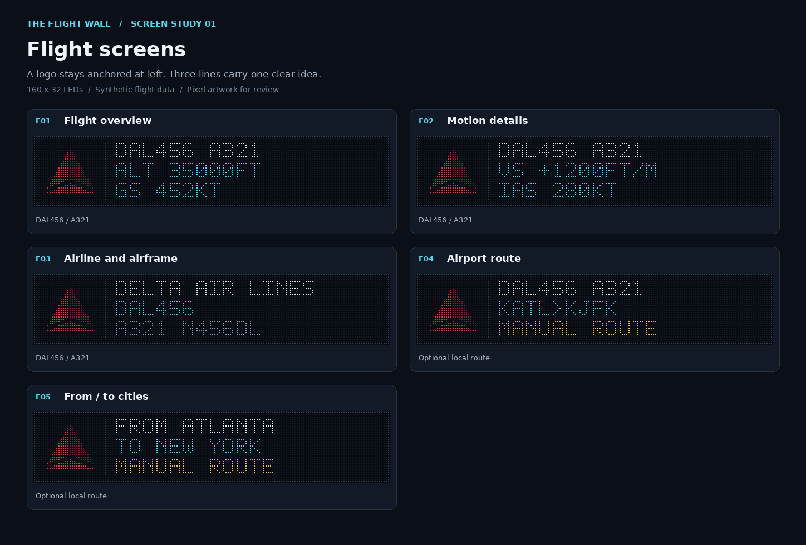
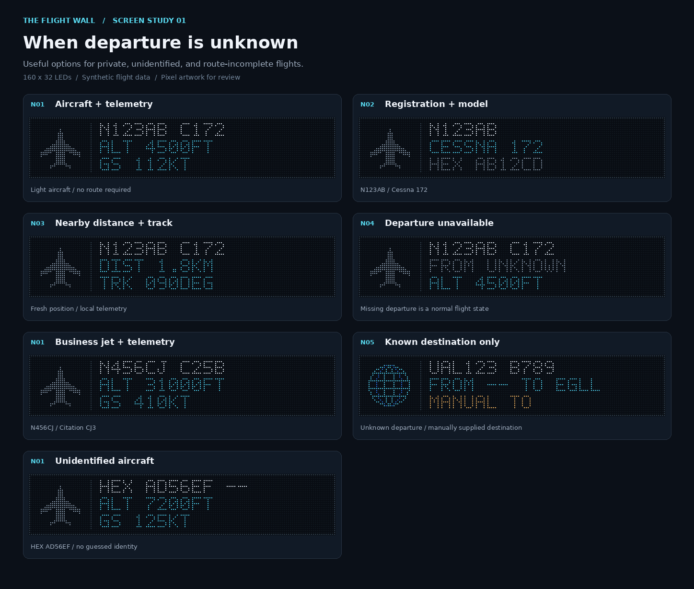

# Flight wall screen review

Prepared October 3, 2026. **Design proposal for review.** The package contains five flight-page designs, seven no-departure/private-aircraft examples, six system states, six partial-data examples, and Delta, United, and Southwest logo variants: **34 rendered screens**. Firmware and live data behavior are not changed by these files.

Start with the [interactive review](review.html) or [five-page review PDF](flightwall-screen-review.pdf). The gallery works offline, includes airline selection, page navigation, no-departure options, status examples, a demo cycle, brightness preview, and layout guides. Its flight collection shows five pages for the selected airline; the complete package includes fifteen airline/page combinations. Choose **No departure** in the collection, or **No departure / private aircraft** in the example menu, to review the seven new examples.

| Review artifact | Contents |
| --- | --- |
| [Flight screen contact sheet](mockups/flight-screens.png) | Five proposed flight pages |
| [Airline logo contact sheet](mockups/airline-logos.png) | Three airline emblems at their intended display size |
| [No-departure options](mockups/no-departure-options.png) | Five layout choices, with light aircraft, business jet, unidentified aircraft, and destination-only examples |
| [Partial-data contact sheet](mockups/data-fallbacks.png) | Missing airline, callsign, route, and telemetry; ground and zero values |
| [System-state contact sheet](mockups/system-states.png) | Boot, setup, Wi-Fi loss, Pi failure, stale receiver, healthy empty sky |
| [Mockup directory](mockups/) | Native 160×32 PNGs, enlarged LED PNGs, and pixel-exact SVGs for all 34 screens |
| [Design fixtures](fixtures.json) | Synthetic review data, not a new production API |
| [Logo manifest](assets/manifest.json) | Artwork source, dimensions, checksums, and review-only approval status |



## Reference and design intent

The repository points to the [commercial Flight Wall](https://theflightwall.com). The inspected visual reference is the repository's [existing wall photograph](../../images/main-image.png), which shows a left airline mark, a city/departure line, an aircraft type, a black background, and a perimeter border. This proposal carries those elements into a reusable logo column and includes a commercial-style city page. It does not claim a survey of the commercial product's current screen catalog.

The physical target is **160×32 pixels**, from twenty 16×16 tiles in a 10×2 arrangement in [HardwareConfiguration.h](../../firmware/config/HardwareConfiguration.h). The [local implementation plan](../flightwall-local-plan.md) calls for actual airline bitmap assets, receiver telemetry, partial-data handling, and distinct failure states. Those requirements inform the new screen set.

The existing [NeoMatrixDisplay.cpp](../../firmware/adapters/NeoMatrixDisplay.cpp) renders airline/route/type text. A logo URL currently causes a boxed text badge; it does not decode and display the airline image. The mockups deliberately include pixel artwork so its size and legibility can be reviewed before that rendering path is implemented.

## Layout specification

All coordinates below are **LED pixels**, with (0, 0) at the top left. Every exported native screen is exactly 160×32. Text and marks use whole pixels, with no antialiasing or high-resolution font substituted inside the wall.

| Region | Coordinates and size | Behavior |
| --- | --- | --- |
| Canvas | x 0–159, y 0–31 | Black unlit background |
| Perimeter | x 0/159 and y 0/31 | One-pixel muted slate border |
| Logo / aircraft / status icon | x 4–27, y 4–27; 24×24 | Known airline emblem, neutral plane for non-airline examples, or system status icon |
| Divider | x 32, y 3–28 | Separates branding from information |
| Text row 1 | x 37, y 3–9 | Callsign/type, airline name, or status title |
| Text row 2 | x 37, y 12–18 | Primary detail |
| Text row 3 | x 37, y 21–27 | Secondary detail / provenance |
| Font | 5×7 glyphs, 6-pixel advance | Uppercase; maximum 20 characters per row, including spaces |

White (`#eaf4ff`) identifies the aircraft or main state. Cyan (`#54d9fa`) carries measured values. Amber (`#ffbf69`) identifies actionable failures and route provenance. Muted text (`#91a5b9`) carries secondary details. Labels and icons also identify each condition, so color is never the only cue. Airline colors remain within the logo area.

The border is quieter than the photographed wall's bright white border, to keep attention on the flight. Preview brightness is a visual review control; it does not write to `DISPLAY_BRIGHTNESS` or simulate electrical power consumption.

## Flight pages

| ID | Page | Example rows | Availability / proposed default |
| --- | --- | --- | --- |
| F01 | Flight overview | `DAL456 A321` / `ALT 35000FT` / `GS 452KT` | Default page; received callsign, known type, barometric altitude, ground speed |
| F02 | Motion details | `DAL456 A321` / `VS +1200FT/M` / `IAS 280KT` | Rotate after F01 when a vertical-rate or airspeed value is present |
| F03 | Airline and airframe | `DELTA AIR LINES` / `DAL456` / `A321 N456DL` | Optional identity page; uses the operating airline |
| F04 | Airport route | `DAL456 A321` / `KATL>KJFK` / `MANUAL ROUTE` | Optional; enable automatic display only when at least one route endpoint has a valid local source |
| F05 | From / to cities | `FROM ATLANTA` / `TO NEW YORK` / `MANUAL ROUTE` | Optional commercial-style page; same sourced endpoints as F04 |

The review's sample flights and registrations are fictional. The fixture hex addresses are illustrative. `DAL456`, `UAL123`, and `SWA789` are callsigns; this design does not silently turn them into marketing/codeshare flight numbers.

Proposed automatic rotation is F01 for **6 seconds**, then F02 for **4 seconds** if useful, then the next eligible aircraft. Selection stays attached to the aircraft hex for the entire sequence, even if feed ordering changes. If F02 has no received values, skip it; a manually selected review example still shows its unknown-value treatment. F03–F05 start disabled. Each adds 4 seconds if enabled and eligible, for a maximum of 22 seconds with all five pages. These are proposed settings, separate from the firmware's current three-second cycle. Review-page demo playback advances every three seconds for convenient inspection.

Use static pages and direct transitions. Avoid marquee text and flashing telemetry. Refresh values on the selected page without resetting its dwell time. A connection/freshness failure replaces flight information immediately; page dwell never extends the validity of a flight record.

### Units and missing information

- `ALT` is **barometric altitude in feet**; `GS` is **ground speed in knots**. Ground altitude renders as `ALT GROUND`, not `ALT 0FT`.
- `VS` is **barometric vertical rate in feet per minute** in this proposal. Render a positive sign for climbs, a negative sign for descents, and `VS 0FT/M` for a received zero. A geometric-only rate needs a separately labeled page/field before use; do not silently mix altitude/rate sources.
- `IAS` and `TAS` keep their own labels. Prefer decoded IAS; use decoded TAS when IAS is absent. If both are absent, render `IAS --KT` in a manually requested details page. Ground speed is never an airspeed fallback.
- Absent values use `--` with the original unit, for example `ALT --FT`. A received numeric zero remains zero.
- Identity falls back from received callsign to registration to `HEX ABC123`. Type can be unknown without suppressing the flight. Registered owner is not treated as the operating airline.
- Airline selection uses the operating ICAO code. If a known operator's logo cannot be loaded, retain a readable code badge. An unknown operator uses its supplied code, or a neutral `AIR` badge when no code is known.
- Truncate long **names** after 17 characters with `...` to fit the 20-character row. Preserve identifiers through field-specific bounds. Metric validation/formatting must preserve the number and unit; never ellipsize a numeric measurement into a misleading value. These fixtures already fit the layout.

### Route provenance

Ordinary ADS-B messages do not supply the itinerary. F04/F05 therefore use only local manual overrides or independently recorded observations/inferences, as described in the local plan. Neither callsign nor heading establishes a route.

Keep each endpoint independently nullable. A missing endpoint is `----` on F04 and `--` on F05. An inferred endpoint carries `?`, plus a visible `INFERRED FROM`, `INFERRED TO`, or `INFERRED ROUTE` label. Two manual endpoints use `MANUAL ROUTE`; two observed endpoints use `OBSERVED ROUTE`. Different endpoint sources use `MIXED SOURCES`. Expired or unsupported endpoints return to unknown. The route-unavailable example is for review; automatic rotation uses the no-departure policy below instead of showing an entirely unknown route.

## Options when departure is unavailable

A private aircraft overhead may have a registration, type, altitude, and speed without a usable departure airport. The same can happen to an airline flight. **Missing departure information is a normal partial-data condition:** keep the aircraft on the wall and choose useful received/local information for the available rows. It does not trigger `NO AIRCRAFT`, loading, or a receiver error.

The recommendation is **N01 Aircraft + telemetry** as the default. A neutral plane replaces the airline mark when no operating airline is known; a recognized airline keeps its logo even when its route is missing. Do not put `PRIVATE` or a registry owner's name on the wall merely because an airline code is absent. The private-aircraft labels in the review describe synthetic examples, not a classification inferred from ADS-B.



| Option | Example rows | When to choose it |
| --- | --- | --- |
| N01 — Aircraft + telemetry **(recommended)** | `N123AB C172` / `ALT 4500FT` / `GS 112KT` | Replace a missing departure/route with aircraft identity and useful measured values; works for private aircraft and airline flights |
| N02 — Registration + model | `N123AB` / `CESSNA 172` / `HEX AB12CD` | Prefer the airframe itself over route information; use a locally known model/type and registration when available |
| N03 — Nearby distance + track | `N123AB C172` / `DIST 1.8KM` / `TRK 090DEG` | Optional spatial detail when fresh position and a confirmed receiver/home location are available |
| N04 — Departure unavailable | `N123AB C172` / `FROM UNKNOWN` / `ALT 4500FT` | Explicitly acknowledge missing departure while keeping identity and a useful measurement visible |
| N05 — Known destination only | `UAL123 B789` / `FROM -- TO EGLL` / `MANUAL TO` | Departure is unknown but the destination has its own valid source; retain that destination and its provenance |

The seven new mockups include these five options plus N01 variants for a **business jet** (`N456CJ C25B`) and an **unidentified aircraft** (`HEX AD56EF --`). The business jet uses the same readable telemetry hierarchy; the unidentified example remains displayable with no callsign, registration, type, or airline.

Proposed settings are a no-departure style (`telemetry`, `identity`, `nearby`, or `explicit`) and a separate **keep known destination** preference, enabled by default. The [design selector](render_mockups.py) demonstrates this order for a route/city page request:

1. If departure has a supported local source, use the sourced route treatment, retaining `?` for an inference. Expired or low-confidence candidates must already be cleared by the local enrichment layer.
2. If departure is absent and keeping a known destination is enabled, show N05 only when that destination has a supported source. An unsourced airport candidate is not enough.
3. Otherwise show the chosen no-departure style. If an identity/nearby style has no useful fields, fall back to N01; do not invent them.
4. Keep identifier precedence: received callsign, then registration, then hex. Keep missing metrics explicit and preserve received zero values. Failure/freshness state screens still take priority over every flight layout.

These are **review choices**, not newly installed device settings. No-departure options replace a requested F04/F05 slot; they are not added as five mandatory pages. N01 can remain the normal six-second F01 overview, with F02 for four seconds when useful. If the replacement is identical to an already shown F01, suppress the duplicate. An explicitly enabled N02/N03/N04/N05 detail uses the normal four-second optional-page dwell on the same selected aircraft. Missing an airport alone never extends the cycle or discards the flight.

For N03, `DIST` means **horizontal ground distance in kilometers** from a confirmed receiver/home position, not slant range or distance to a guessed airport. `TRK` means received **ground track in degrees relative to true north**, not aircraft heading. The example's distance and track are synthetic. Live integration needs valid fresh coordinates and the actual configured center; it must not use the firmware's example location. If a single metric is absent, retain `DIST --KM` or `TRK --DEG`. If both are absent, skip this option automatically. Distance and track do not establish the aircraft's departure.

## Partial-data examples

| ID | Example | Required visible result |
| --- | --- | --- |
| C01 | Unknown operator and missing altitude/type | `XYZ` badge, `XYZ42 --`, `ALT --FT`, and valid `GS 210KT` |
| C02 | Missing callsign/registration, received zero speed | Neutral `AIR` badge, `HEX ABC123 C172`, and `GS 0KT` |
| C03 | Ground aircraft | Airline mark, `ALT GROUND`, `GS 0KT` |
| C04 | No route information | Airline mark, `---->----`, `ROUTE UNKNOWN` |
| C05 | Only an inferred departure | Airline mark, `KATL?>----`, `INFERRED FROM` |
| C06 | No vertical rate or airspeed | Airline mark, `VS --FT/M`, `IAS --KT` |

United's F02 also demonstrates true airspeed (`TAS 470KT`) and a received zero vertical rate. Southwest's F02 demonstrates a descent (`VS -1500FT/M`).

## System states and priority

System pages replace the airline logo with a neutral icon and clear all prior aircraft details. Their purpose is to tell the viewer whether setup, connectivity, decoder data, or a quiet sky explains the absence of a flight.

| ID | Trigger | Visible message | Recovery |
| --- | --- | --- | --- |
| S01 | Starting before a usable feed/configuration | `FLIGHT WALL` / `STARTING` / `PLEASE WAIT` | Advance as soon as setup/connection/feed state is known |
| S02 | Initial or explicitly activated BLE setup | `SETUP VIA BLE` / `CONNECT TO WALL` / `SET WIFI + PI` | Leave after configuration or setup-window expiry |
| S03 | ESP32 Wi-Fi disconnected | `WIFI LOST` / `RECONNECTING` / `CHECK ROUTER` | Bounded Wi-Fi retries; retain saved working settings |
| S04 | Wi-Fi connected; Pi timeout, invalid response, or unavailable service | `PI UNAVAILABLE` / `WIFI CONNECTED` / `CHECK PI + PORT` | Retry the configured LAN endpoint |
| S05 | Pi reachable; receiver snapshot missing, invalid, or stale | `RECEIVER STALE` / `CHECK READSB` / `NO LIVE DATA` | Wait for a fresh valid receiver snapshot |
| S06 | Fresh healthy receiver; no eligible aircraft | `NO AIRCRAFT` / `IN YOUR AREA` / `RECEIVER OK` | Resume F01 when a fresh eligible aircraft appears |

After startup, evaluate active setup first, then Wi-Fi, Pi availability, receiver freshness, empty candidate set, and finally flight pages. An expired individual aircraft must be removed even while the receiver is healthy. Use the local plan's initial **5-second snapshot** and **15-second aircraft/position** age thresholds, with source timestamps rather than HTTP response time; make these configurable during implementation. Missing freshness cannot establish a live flight. Once a fresh feed returns, start the chosen aircraft on F01 rather than resuming an old route/details frame.

BLE setup and connection recovery are **screen concepts**, not implemented provisioning/retry logic in this package. The static examples and demo are an inspection tool, not an emulation of receiver failures.

## Airline artwork

The review includes original hand-drawn **pixel interpretations** of the Delta widget, United globe, and Southwest heart. All are 24×24 RGB images on black, reused consistently across the flight pages. They are simplified review artwork, not downloaded official artwork or production-approved logo assets. The [manifest](assets/manifest.json) records reference URLs, conversion notes, date/version, SHA-256, dimensions, and `production_approved: false`; it does not claim verified reuse rights for official brand artwork.

For firmware integration, follow the existing local plan's individually approved asset workflow. Keep source and approval metadata, convert during maintenance to 24×24 RGB565 with explicit byte order and alpha/background policy, serve through the Pi's existing host/port, and cache bounded assets on the ESP32. A missing/corrupt/unapproved bitmap falls back to the operator badge. Rendering and flight requests must not download logos from the internet.

## Opening and regenerating the review

Open `docs/screens/review.html` in a browser. Its screen data, CSS, and script are embedded, so the preview needs no npm packages, API keys, or live receiver. Keep the directory together for the linked PDF and image downloads. If a managed browser blocks local file URLs, serve the folder locally from the repository root:

```sh
python3 -m http.server 8088 --bind 127.0.0.1 --directory docs/screens
```

Then open `http://127.0.0.1:8088/review.html`. Use Left/Right for navigation and Escape to pause the demo. The layout guides show the logo/text bounds. The collection can filter flight pages, no-departure options, data cases, or states. Direct links such as `review.html#motion-united`, `review.html#no-departure-telemetry`, `review.html#no-departure-nearby`, or `review.html#state-receiver` select a specific screen. Within the no-departure group, navigation/demo cycles through its seven alternatives for comparison.

To change the proposal, edit [fixtures.json](fixtures.json), the pixel/layout logic in [render_mockups.py](render_mockups.py), or [review-template.html](review-template.html), then regenerate. Do not edit generated `review.html`, `screens.json`, assets, or mockups directly.

```sh
# Exporter needs Pillow and the DejaVu Sans font for contact-sheet labels only.
python3 docs/screens/render_mockups.py
python3 docs/screens/render_mockups.py --check

# Optional browser verification needs Playwright and an installed Chromium.
python3 docs/screens/verify_review.py --browser /usr/bin/chromium
```

The display's 5×7 font itself is embedded as whole-pixel patterns. The exporter writes `*-native.png` at 160×32, `*.png` with LED dots at 1280×256, and `*.svg` as pixel rectangles at a 5:1 aspect ratio. It also regenerates the five contact sheets, review PDF, logo manifest, serialized screen data, and self-contained HTML.

## Review and implementation boundary

Review the logo size/recognition, F01 information hierarchy, preferred no-departure option, desired optional pages, proposed dwell times, route labels, and clarity of S03–S06. The generated pack makes those choices concrete without requiring a physical panel.

After design review, firmware work needs nullable telemetry and freshness in `FlightInfo`, a real local Pi feed, actual RGB565 logo rendering/cache, the selected page/state machine, and simulator mapping that matches the full matrix. The current Wokwi configuration is only **64×32**; it cannot demonstrate the full 160×32 layout without a separate full-size fixture. No firmware build/flash or Pi deployment is part of this design package.

Local verification checks all 34 native frame dimensions and text bounds; zero/unknown/ground semantics; signed vertical speed; IAS/TAS labels; route inference markers; no-departure style selection, sourced-destination preservation, registration/hex identity, distance/track labels, and missing-value fallbacks; gallery controls and deep links; download targets; mobile overflow; and absence of external browser requests. Real-panel acceptance still needs viewing-distance legibility, logo recognition, tiled pixel order, actual brightness, and live freshness/state transitions. Browser previews do not establish those hardware results.
